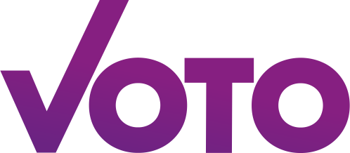

# VOTO - Vote advise application

<p align="center">
  <a href="https://voto.vote">
    
  </a>

  <h3 align="center">Voting made easy</h3>
</p>

  
  
  
  

This project contains the offical VOTO web app based on Next.js and Tailwind CSS. To learn more about VOTO, we kindly refer to our [documentation repository](https://github.com/voto-vote/.github/tree/main/profile).

## Development

**Clone the repository**
   ```bash
   git clone https://github.com/voto-vote/app.git
   cd app
   ```

**Install dependencies**
   ```bash
   npm install
   ```

**Set up environment variables**

Copy the `.env.example` to `.env` and fill out the parameters.

> [!IMPORTANT]  
> Right now this app depends on the not-yet-open-sourced VOTO-portal.
> We intend to integrate the portal into this app in the future.

**Run the development server**

```bash
npm run dev
```

Open [http://localhost:3000](http://localhost:3000) with your browser to see the application.

## Learn More

To learn more about our framework and dependencies, take a look at the following resources:

- [Next.js Documentation](https://nextjs.org/docs) - learn about Next.js features and API.
- [Tailwind CSS Documentation](https://tailwindcss.com/docs) - learn about Tailwind CSS concepts and classes.
- [Motion Documentation](https://motion.dev/docs) - learn about Motion's animation features
- [Zustand](zustand.docs.pmnd.rs) - learn about Zustand's state management
